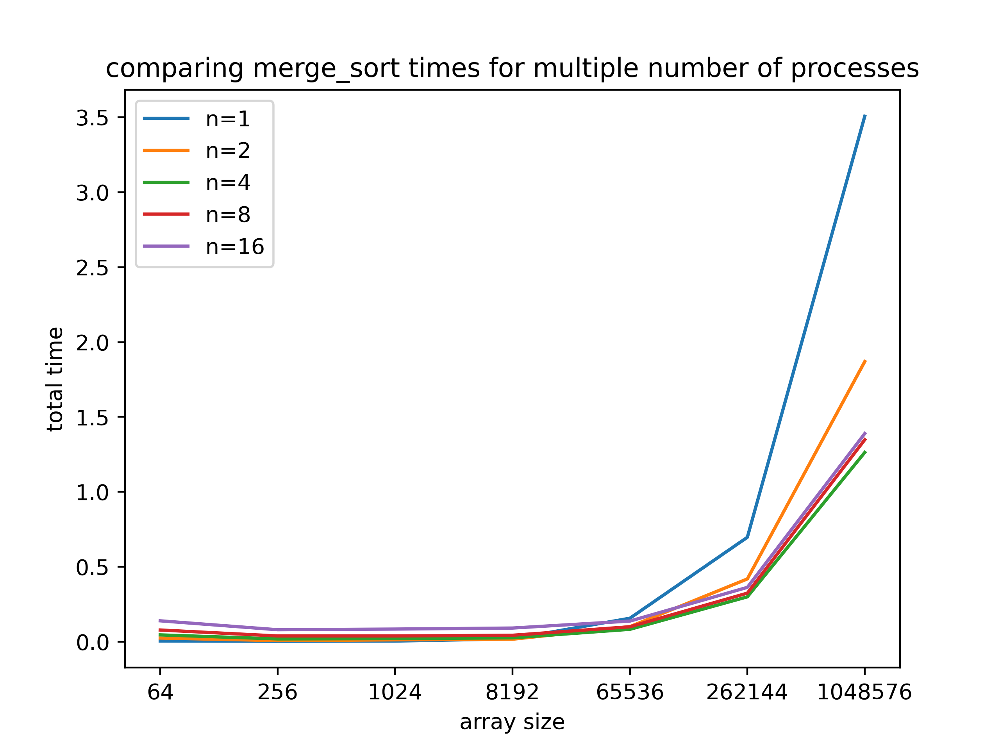
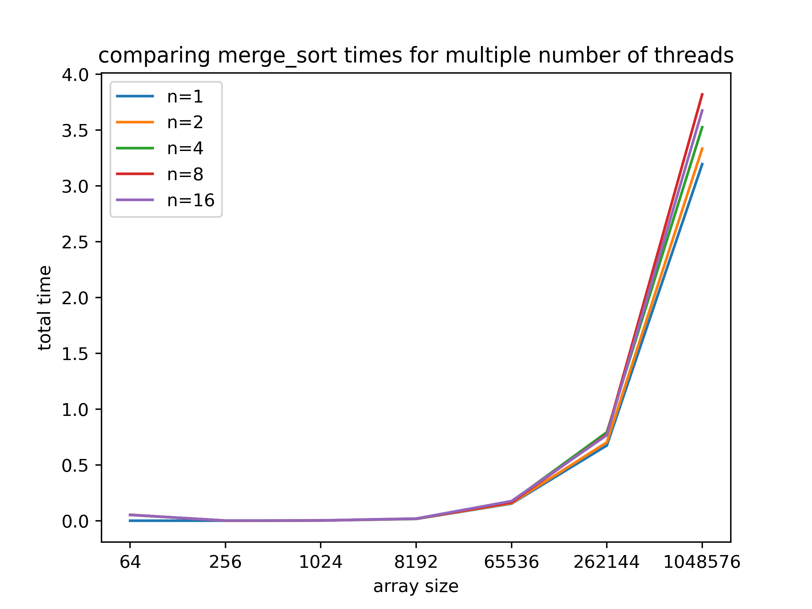
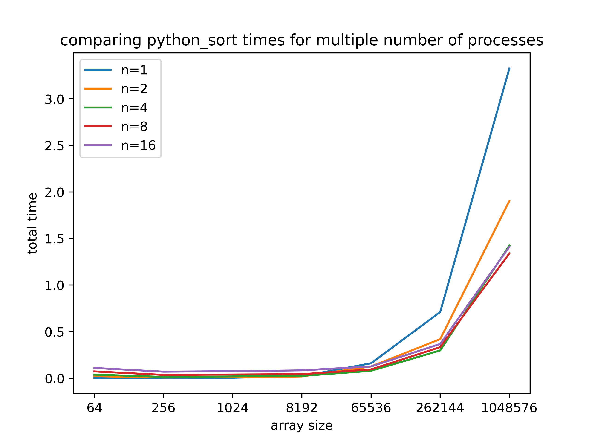
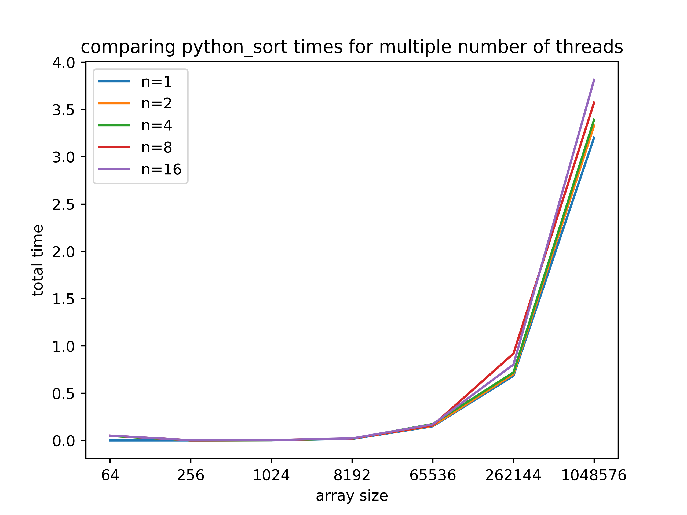
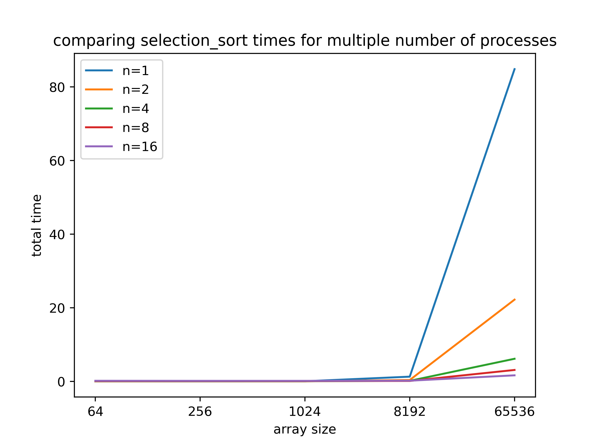
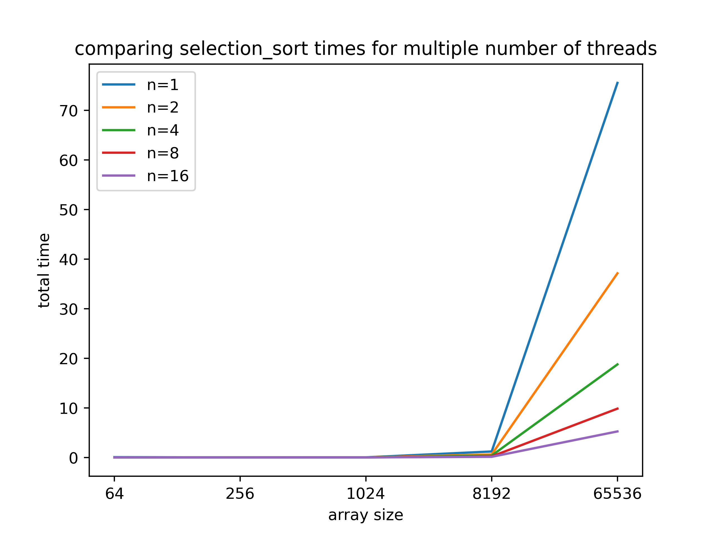

# Laboratório 1 - Paralelismo de Processos e Threads

## Integrantes do grupo
2022132020 - Mestrado - Breno Aguiar Krohling

2021231578 - Mestrado - Lucas Miguel Tassis

2022241702 - Doutorado - Vitor Fontana Zanotelli

## Introdução
Nesse laboratório, foi pedido a implementação de algoritmos de ordenação utilizando paralelismo de processos e threads. As implementações foram realizadas utilizando a linguagem Python, com o auxílio das bibliotecas `multiprocessing`e `multithreading`.

No restante desse documento será apresentado a organização do diretório e intruções para execução, detalhes da implementação, e por fim, resultados obtidos e conclusões.

## Organização do diretório e instruções para execução

### Organização do diretório
O diretório está organizado da seguinte forma:

`./parallel_process_sort.py`: é o arquivo que contém a implementação do paralelismo utilizando processos com a utilização da lib `multiprocessing` do Python.
`./parallel_thread_sort.py`: é o arquivo que contém a implementação do paralelismo utilizando threads com a utilização da lib `multithreading` do Python.
`./utils.py`: contém algumas funções utilitárias utilizada em ambas implementações do paralelismo, como as funções para gerar um *array* aleatório e fazer seu *split* em partes.
`./sort.py`: contém a implementação dos algoritmos de *merge sort* e *selection sort*.
`./script.py`: é um script para gerar um *plot* comparando o tempo de execução com diferente número de threads/processos.

### Instruções para execução
Para execução dos algoritmos de ordenação paralela basta utilizar o seguinte comando:

`python parallel_process_sort tamanho_array num_processos algoritmo_sorting`

ou,

`python parallel_thread_sort tamanho_array num_threads algoritmo_sorting`

Por exemplo, se quiser realizar a ordenação de um vetor de tamanho 1000, utilizando 4 processos e o algoritmo *merge sort*, basta executar o seguinte comando:

`python parallel_process_sort 1000 4 merge_sort`

Três opções de algoritmo de ordenação são disponibilizadas (utilizando as keywords abaixo no lugar da variável `algoritmo_sorting`):

`merge_sort`: implementação do *merge_sort*.

`selection_sort`: implementação do *selection sort*.

`python_sort`: implementação utilizando o método `.sort()` nativo do Python.

## Implementação

Assim como mencionado anteriormente, a implementação dos algoritmos de ordenação foi feita utilizando a linguagem Python, com auxílio das bibliotecas `multiprocessing`e `multithreading`. A implementação geral seguiu as instruções dadas na especificação do laboratório, *i.e.*, dado um tamanho de vetor, número de processos/threads, deve-se:

* gerar um vetor aleatório com o tamanho dado;
* separar o vetor em partições, onde o número de partições é igual ao número de processos/threads dado;
* ordenar as partições separadamente em cada processo/thread;
* fazer o merge das partições ordenadas, de par a par.

Essa foi a lógica geral seguida para implementar tanto o paralelismo de processos (disponibilizado no arquivo `parallel_process_sort.py`), quanto para o para o paralelismo de threads (dispobilizado no arquivo `parallel_thread_sort.py`). 

Porém, devido a diferente natureza das formas de paralelismo, cada uma das implementações tiveram algumas particularidades, que serão discutidas a seguir.

### Paralelismo de processos
No caso específico do paralelismo de processos, para que fosse acessado o resultado dos processos (partições do vetor ordenadas), foi necessário o uso de uma fila compartilhada, em que cada processo depositou seu resultado no término de sua computação. Essa fila foi implementada utilizando a `multiprocessing.Queue`.

Após todos os processos depositarem os resultados das partições ordenadas, foi possível resgatar essas partições com o uso da fila, e seguir com o *merge*. No processo de *merge*, foi utilizado uma fila para salvar os resultados do *merges* intermediários, análogo ao processo de ordenação.

Alguns problemas surgiram no uso dessa fila, particularmente quando eram utilizados vetores de tamanho muito grande. Existe um problema documentado de que caso o dado que você  deposite na fila seja muito grande, pode haver um *deadlock*, com um outro processo tentando depositar seu dado nessa fila já carregada. Mais detalhes desse problema pode ser encontrado no seguinte [link](https://stackoverflow.com/questions/31665328/python-3-multiprocessing-queue-deadlock-when-calling-join-before-the-queue-is-em) . E uma das soluções indicadas pela própria documentação oficial do python é retirar os *joins* do código (referência: [link](https://docs.python.org/3/library/multiprocessing.html#all-start-methods), na seção *Joining processes that use queues*), que foi o que decidimos fazer.

### Paralelismo de threads
Como o paralelismo de thread não tem o problema de comunicação (como no paralelismo de processos), não foi necessário utilizar a fila. As modificações foram feitas nas próprias variáveis. Além disso, como não há uso da fila, não existe o problema do *deadlock*.

## Resultados e Discussão

### Setup Experimental

Para os experimentos utilizamos arrays de tamanho: [64, 256, 1024, 8192, 65536, 262144, 1048576] para o *mergesort* e *python sort*; e [64, 256, 1024, 8192, 65536] para o *selection sort* (por conta do tempo de computação). O número de processos/threads utilizados foram: [1, 2, 4, 8, 16]. Para cada algoritmo de ordenação, fizemos dois plots: (1) comparando o tempo de computação entre o número de processos utilizados; (2) comparando o tempo de computação entre o número de threads utilizado. Os resultados obtidos são apresentados a seguir.

### Mergesort

A figura abaixo apresenta os resultados obtidos utilizando o mergesort como algoritmo de ordenação.

  

### Python Sort

A figura abaixo apresenta os resultados obtidos utilizando o `.sort()` do python como algoritmo de ordenação.

 

### Selection Sort

A figura abaixo apresenta os resultados obtidos utilizando o selection  sort como algoritmo de ordenação.

 

### Discussão geral

Observando os resultados apresentados, a primeira coisa que pode-se notar é que os resultados do merge sort e python sort foram semelhantes. Isso se deve ao fato de que o `.sort()` do python realmente utiliza um algoritmo baseado no merge sort. 

Observando os gráficos de threads para esses dois algoritmos, notamos que o uso de threads não promoveu nenhum ganho significativo de desempenho, independente do tamanho de vetor utilizando. Isso provavelmente se deve à forma que o *threading* é implementado em Python. O *global interpreter lock* (GIL) não permite que o Python execute múltiplas threads ao mesmo tempo. Uma explicação mais detalhada do que ocorre pode ser encontrada na [documentação do Python](https://wiki.python.org/moin/GlobalInterpreterLock) e também, nesse [post](https://pythonspeed.com/articles/python-gil/). Apesar disso, percebemos que no selection sort há um ganho ao utilizar threading. Isso provavelmente deve-se ao fato de que o algoritmo de ordenação selection sort é menos eficiente que os outros dois apresentados anteriormente, apresentando um ganho maior ao utilizar multhreading.

Observando agora os gráficos do paralelismo de processo, notamos que há uma pequena vantagem ao utilizar o paralelismo, porém ainda não significativa para os dois primeiros algoritmos de ordenação. Isso provavelmente acontece porque o *overhead* do uso de muitos processos e do uso da fila acaba acrescentando no tempo de computação. Por esse motivo, é que o número de processos igual a 4 foi o que teve um melhor resultado no geral, por conta do *tradeoff* maior número de processos/*overhead*. Novamente no selection sort, observa-se o ganho ao utilizar mais processos, novamente, acreditamos que isso se deve a menor eficiência do algoritmo comparado aos outros dois.

Por fim, houve algum ganho com a utilização do paralelismo de processos/threads... porém um ganho menor do que esperado. Ao que tudo indica (pelas referências mencionadas), isso é um problema com o sistema de multi-processos e multithreading do próprio Python, que acaba acrescentando um gargalo no desempenho dessas técnicas. É por conta disso que algumas bibliotecas como, por exemplo, o NumPy, mudam o código em C do python para acrescentar paralelismo real para aumento de desempenho, ao invés de utilizar o disponibilizado pelo próprio Python.

## Conclusão

Nesse trabalho, implementamos algoritmos de ordenação utilizando paralelismo de processos e threads utilizando a linguagem Python. Observamos que existe algumas vantagens ao utilizar essas técnicas, porém que a linguagem Python acaba prejudicando muito o seu uso, já que existem alguns gargalos impostos pela própria linguagem. Apesar disso, percebemos que para algoritmos menos eficientes (selection sort), ainda é observado algum ganho. Porém, para algoritmos mais otimizados, como o mergesort e o python sort, o *overhead* acrescentado pelo uso das técnicas acaba sendo semelhante ao ganho de seu uso.

