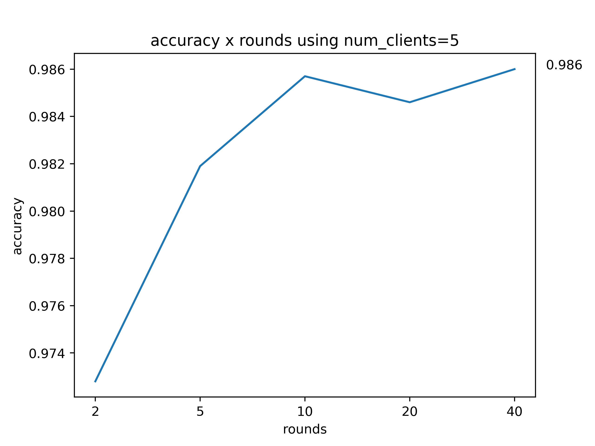

# Laboratório 2 - Aprendizado Federado

[Link do video](https://drive.google.com/file/d/14SPT_tr1lYxmNZdtn3WowU2hRJtpbTDL/view?usp=share_link)

## Integrantes do grupo

2022132020 - Mestrado - Breno Aguiar Krohling

2021231578 - Mestrado - Lucas Miguel Tassis

2022241702 - Doutorado - Vitor Fontana Zanotelli

## Introdução
Nesse laboratório, foi pedido para experimentar com modelos de aprendizado de máquina e, mais especificamente, o aprendizado federado. Para isso, foi utilizado a biblioteca `flower` para implementação dos modelos. Ao longo da lista foram comparados uma série de configurações de treinamento, e também foram comparados modelos federados e locais.


## Atividade 1

Na primeira atividade foi pedido para avaliar o treinamento da rede federada variando o número de *rounds*. Foram pedidos valores de *round* 10, 15 e 20. Ao fim, era para realizar o *plot* do resultado.

### Organização do diretório e instruções para execução

#### Organização do diretório

Os códigos da atividade 1 estão no diretório `./atividade-1`. Essa atividade contém um único script `script.py` que faz o treinamento federado utilizando`round = [10, 15, 20]`. O código utilizado foi copiado do notebook disponibilizado, e simplesmente colocado em um `.py`para facilitar a execução.

#### Instruções para execução

Basta executar o comando `python script.py`

### Resultados e discussões

Os resultados obtidos foram o seguintes:

     

Como pode-se observar nos gráficos, o resultado obtido foi muito semelhante nas três configurações. Isso se deve ao fato de que como o conjunto de dados é um conjunto *toy*, o aprendizado da rede consegue convergir em menos de 10 *rounds*. Para comparação, podemos ver que o treinamento local obteve resultado semelhante, que foi reportado no notebook disponbilizado como 0.985 de acurácia. Novamente, como esse é um conjunto relativamente simples, é esperado que os resultados sejam semelhantes.

## Atividade 2

Na segunda atividade, foi pedido para realizar o treinamento federado utilizando diferentes processos. Para isso foi necessário criar dois programas em Python, `client.py ` e `server.py`. Ao fim, era necessário plotar a acurácia para `rounds = [2, 5, 10, 20, 40]`. Com uma quantidade mínima de clientes igual a cinco. Foram utilizados cinco clientes.

### Organização do diretório e instruções para execução

#### Organização do diretório

Os códigos da atividade 2 estão no diretório `./atividade-2/`. Existem dois scripts `client.py` e `server.py`, com os códigos do cliente e servidor, respectivamente.

#### Intruções para execução

Para executar o servidor basta utilizar o comando `python server.py`. Para executar cada um dos cinco clientes, deve-se utilizar o comando `python client.py nome-cliente`, *e.g.*, `python client.py c1`.

### Resultados e discussões

Os resultados obtidos utilizando cinco clientes foi:



Pode-se observar que o resultado final obtido (com 40 *rounds*), foi bem semelhante ao reportado ateriormente. Isso deve-se ao mesmo motivo do conjunto de dados ser simples, e portanto, a rede converge em menos rounds.

### Atividade 3

Na terceira atividade, foi pedido para propor duas novas redes não-convolucionais para avaliar o aprendizado federado e local. Ao fim, deve-se comparar os resultados obtidos. Nessa atividade, foi utilizado o esquema de treinamento utilizado na atividade 1, *i.e.*, sem processos separados e utilizando a própria simulação do `flower`. Foram propostas duas novas arquiteturas de redes MLP: `model_1`, com uma camada escondida de tamanho 100, e `model_2`, com duas camadas escondidas, uma de tamanho 100 e outra de tamanho 50:

```python
def define_model_1(input_shape, num_classes):
    model = Sequential()
    model.add(Flatten(input_shape=[input_shape[0], input_shape[1]]))
    model.add(Dense(100, activation='relu', kernel_initializer='he_uniform'))
    model.add(Dense(num_classes, activation='softmax'))
    opt = SGD(learning_rate=0.01, momentum=0.9)
    model.compile(optimizer=opt, loss='categorical_crossentropy', metrics=['accuracy'])

    return model
```

```py
def define_model_2(input_shape, num_classes):
    model = Sequential()
    model.add(Flatten(input_shape=[input_shape[0], input_shape[1]]))
    model.add(Dense(100, activation='relu', kernel_initializer='he_uniform'))
    model.add(Dense(50, activation='relu', kernel_initializer='he_uniform'))
    model.add(Dense(num_classes, activation='softmax'))
    opt = SGD(learning_rate=0.01, momentum=0.9)
    model.compile(optimizer=opt, loss='categorical_crossentropy', metrics=['accuracy'])

    return model
```

Foram utilizados 10 clientes no aprendizado federado e 10 *rounds* de treinamento. Para o treinamento local, a rede treinou por 10 épocas.

### Organização do diretório e instruções para execução

#### Organização do diretório

Os códigos da atividade 3 estão no diretório `./atividade-3/`. Existem dois scripts: (1) `federated.py`, contendo a implementação das duas redes para simulação federada, e (2) `local.py`, contendo a implementação das duas redes para simulação local (não federada).

#### Instruções para execução

Para executar a simulação federada basta executar `python federated.py`. E para executar a simulação local basta executar `python local.py`.

### Resultados e discussões

Os resultados do aprendizado federado para os dois modelos foram:

   

E para o aprendizado local:


Como pode-se observar, tanto para o aprendizado local quanto para o federado, o modelo 2 (com duas camadas), obteve resultado melhor. Sendo que o resultado obtido no treinamento local foi um pouco superior ao do aprendizado federado. Porém, os dois foram muito semelhantes, e com diferença não significativa, dado o conjunto de dados que foi utilizado.

Os resultados obtidos também foram um pouco pior do que os obtido pela rede utilizando uma camada convolucional. Mas novamente, bem semelhantes no geral, devido ao simples conjunto de dados.
