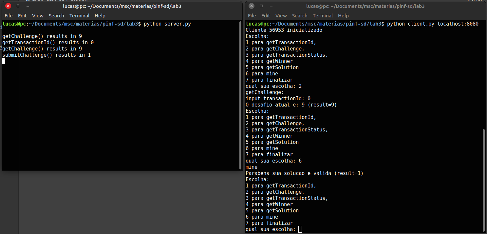

# Laboratório 3 - Chamada de Procedimento Remoto

[Link do video]()

## Integrantes do grupo

2022132020 - Mestrado - Breno Aguiar Krohling

2021231578 - Mestrado - Lucas Miguel Tassis

2022241702 - Doutorado - Vitor Fontana Zanotelli

## Introdução

Nesse trabalho, foi pedido a implementação de um protótipo similar a um minerador de criptomoedas no modelo cliente/servidor baseado em RPC. A implementação do cliente e servidor foram feitas utilizando a linguagem Python e com o auxílio do gRPC. Para validação, foram feitos alguns testes usando diferente número de clientes.

## Organização do diretório e instruções para execução

### Organização do diretório

Todos os códigos implementados estão disponibilizados no diretório `lab3/`. O arquivo `client.py` possui a implementação dos clientes responsáveis pela mineração. O arquivo `server.py` possui a implementação do servidor. O arquivo `mine_grpc.proto` é o arquivo combinado com a turma utilizado para gerar os *stubs*. 

### Instruções para execução

Para execução do código basta inicialmente subir o servidor com o comando `python server.py`. Para execução dos clientes basta utilizar o comando `python client.py address`, por exemplo, `python server.py localhost:8080`. O client possui uma interface de texto bastante simples para comunicação e utilização de comandos.

## Implementação

### server.py

A implementação do servidor consistiu em basicamente implementar as funções pedidas na tabela apresentada na especificação. Para manter os dados da tabela de transações foi utilizado um `pandas.DataFrame`. Ao ser inicializado é criado um novo desafio com valor `random.randint(1, 20)`. Foi adicionado que após um desafio ser resolvido com sucesso por algum cliente, um novo desafio é criado automaticamente, também com valor `random.randint(1, 20). ` Toda a implementação da classe do servidor e seus métodos é encontrada dentro do arquivo `server.py` na classe ` Servicer(mine_grpc_pb2_grpc.apiServicer)`. 

### client.py

A implementação dos clientes consistiu em criar uma interface simples para interação do usuário e requisição das funções pedidas na especificação. A função mais interessante é provavelmente a função de `mine()`, onde é feita  mineração. Sua implementação foi:

```python
# From https://codereview.stackexchange.com/a/260276
def str_bin_in_4digits(hex_string: str) -> str:
    """
    Turn a hex string into a binary string.
    In the output string, binary digits are space separated in groups of 4.

    >>> str_bin_in_4digits('20AC')
    '0010000010101100'
    """

    return f"{int(hex_string,16):0{len(hex_string)*5-1}_b}".replace('_', '')

def mine(client, client_id):
    transactionId = client.getTransactionId(mine_grpc_pb2.void()).result
    challenge = client.getChallenge(mine_grpc_pb2.transactionId(transactionId=transactionId)).result   
    i = 0 
    while True:
        res = hashlib.sha1(str(i).encode()).hexdigest()
        bin_res = str_bin_in_4digits(res)
        if bin_res[:challenge] == challenge * '0':
            r = client.submitChallenge(mine_grpc_pb2.challengeArgs(transactionId=transactionId, clientId=client_id, solution=res))
            return r
        i += 1
```

Basicamente o que foi feito é um algoritmo bem simples para testar os *hashes*. O *loop* basicamente vai testando valores de string *i* no formato binário que é o formato de entrada pedido pela biblioteca `hashlib`. Depois disso ele testa se esse *hash*  é solução para o problema. Como a saída da função `hashlib.sha1()` é uma string em hex, foi utilizada uma função encontrada na internet para transformar em uma string de bits (a referência de onde foi encontrada é citada no código).  

O restante da implementação é basicamente a implementação da interface como pedida na tabela de especificação. Note que foi utilizado apenas o single threading, já que como visto no laboratório 1, o GIL do Python pode prejudicar o desempenho do multi-threading.

Ao inicializar cada cliente, um `client_id` aleatório é gerado.

### Comentários sobre experimentos e resultados

A imagem abaixo mostra um exemplo simples, apenas mostrando a interface de um cliente.



Foi possível encontrar hashes iniciando com 20 zeros de forma bem rápida apesar de ser um problema difícil, dado que a probabilidade é de encontrar essa chave é de $\frac{1}{2^n}$. Porém, um *loop* iniciando de 1 e indo até $2^20$, que é aproximadamente 1M é computado em pouco tempo, logo uma chave também pode ser encontrada nesse intervalo, ou pelo menos foi isso que achamos :) . Valores maiores começam a ficar mais difíceis (como esperado), mas não foi feito um estudo  mais profundo para medir o quão maior. 

Pesquisando sobre isso, encontramos esse [link](https://people.cs.rutgers.edu/~pxk/419/hw/a-13.html) que fala de um problema semelhante (encontrar o sufixo, dado um prefixo, que forma a hash com d número de zeros). Na seção An Easier Puzzle > Adaptative Complexity, podemos ver uma tabela comparando alguns tempos de execução variando o d, e notamos que para ~d = 20, um resultado é também encontrado de forma bem rápida. 

