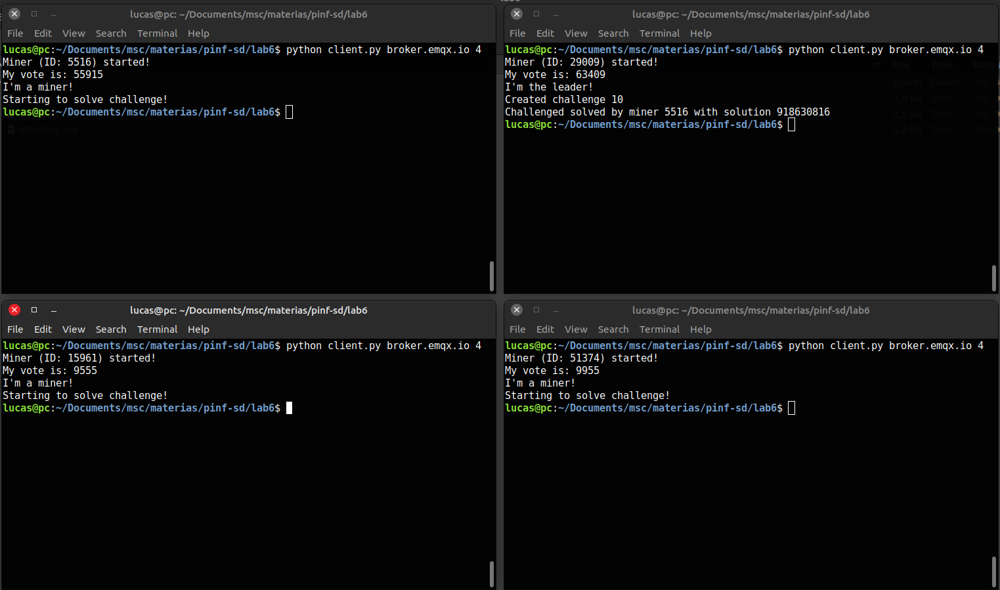

# Laboratório 6 - Eleição e Coordenação Distribuída

[Link do video](https://drive.google.com/file/d/1I5rStGq6EjZwuEw6ftpGYQpABQClXT2v/view?usp=sharing)

## Integrantes do grupo

2022132020 - Mestrado - Breno Aguiar Krohling

2021231578 - Mestrado - Lucas Miguel Tassis

2022241702 - Doutorado - Vitor Fontana Zanotelli

## Introdução

Nesse trabalho, foi pedido a implementação de um protótipo similar a um minerador de criptomoedas utilizando um sistema de comunicação indireta por meio de um *middleware Publish/Subscribe* utilizando fila de mensagens. O broker utilizado foi o EMQX. A implementação dos clientes foram feitas utilizando a linguagem Python e com o auxílio da biblioteca `paho`. Nesse laboratório também foi pedido para implementar eleição e coordenação distribuída entre os mineradores, para escolha do líder (coordenador) e mineradores.

## Organização do diretório e instruções para execução

### Organização do diretório

Todos os códigos implementados estão disponibilizados no diretório `lab6/`. O arquivo `client.py` possui a implementação dos clientes mineradores/líder que serão executados. O arquivo `miner.py` possui a implementação da classe `Miner`,  que possui a implementação da lógica de coordenação e mineração, para quem for escolhido como líder/minerador.

### Instruções para execução

Para execução dos clientes basta utilizar o comando `python client.py <broker_addr> <num_clients>`, onde `<broker_addr>` é o endereço do broker, e `<num_clients>` é o número de clientes que irão ser executados durante a rodada. Por exemplo, se quisermos fazer uma simulação com 3 clientes e utilizando o broker público disponibilizado pelo EMQX, basta executar `python client.py broker.emqx.io 3`.

## Implementação

Como mencionado na seção anterior, foram implementados dois arquivos: (1) `client.py` contendo a implementação do cliente dos mineradores; (2) `miner.py` contendo a classe `Miner`, que possui a implementação da lógica dos mineradores (salvar variáveis como lista de mineradores no sistema, votações, bem como operação de mineração e coordenação). Com esses dois arquivos foi implementado a eleição coordenada.

Para a eleição coordenada foi seguido o fluxograma apresentado na especificação do laboratório. Inicialmente os mineradores se conectam no sistema e mandam uma mensagem para a fila `sd/init`. Cada minerador, ao receber as mensagens dos outros mineradores, vai adicionando esses mineradores a sua lista de mineradores do sistema. Esse processo continua até todos os mineradores terem todos os N mineradores em sua lista. Uma vez que todos os mineradores do sistema são inicializados, pode-se começar a eleição. 

Na eleição, cada minerador envia para a fila `sd/voting` seu voto com valor `[0..65335]`. Os mineradores atualizam seu dicionário contendo o  `{id : vote}` de cada um dos outros mineradores (inclusive o seu voto). Ao fim da votação (todos os mineradores terem enviado e adicionado os outros em sua lista), cada um dos mineradores verifica se é lider ou minerador baseado em seu dicionário interno.

Com a eleição pronta, o minerador que verificou ser o líder cria o desafio (definimos o valor do desafio como `random.randint(10, 20)`) e envia ela para a fila `sd/challenge`. O líder bloqueia e fica esperando os resultados (que são enviados para a fila `sd/result`). Os mineradores, ao receber a mensagem de desafio, começam a minerar, e, ao achar algum resultado, o envia para a fila `sd/result`. O líder verifica o resultado, e caso seja solução ele termina o processo.

Para facilitar a finalização do processo e avisar os outros mineradores que o problema já foi resolvido (para que não fiquem resolvendo o problema sem necessidade), criamos uma fila `sd/exit`, em que o líder publica uma mensagem só para avisar os mineradores que eles podem finalizar seu processo. 

A lógica do algoritmo de mineração foi semelhante a do laboratório 3 e 5, então não repetimos aqui. Todas as mensagens foram passadas por uma string JSON com os dados especificados.

## Comentários sobre experimentos e resultados
A imagem abaixo mostra o print de um exemplo utilizando 4 clientes no sistema. As mensagens nos terminais mostram a coordenação entre os clientes.

Como mostrado, os participantes inicializam, fazem a votação. O com maior voto é eleito o líder, e, ao antes de finalizar o processo, o líder avisa quem solucionou e qual solução. 

