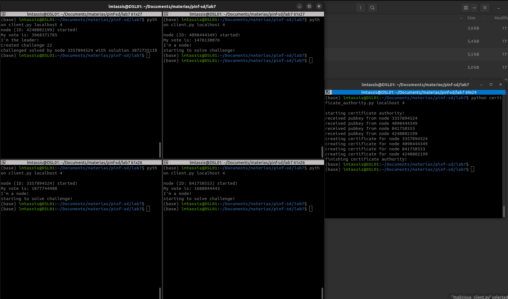
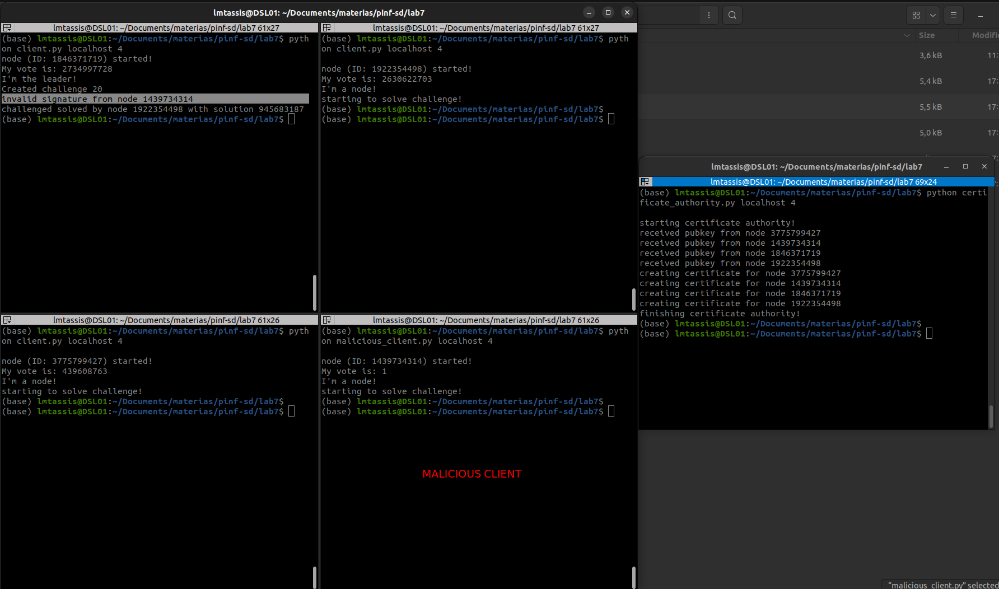

# Laboratório 7 - Assinaturas digitais

[Link do video](https://drive.google.com/file/d/1H3V7R3gmhowC7zFNxyNPecuA61Bw66Eu/view?usp=sharing)

## Integrantes do grupo

2022132020 - Mestrado - Breno Aguiar Krohling

2021231578 - Mestrado - Lucas Miguel Tassis

## Introdução

Nesse trabalho, foi pedido a implementação de um protótipo similar a um minerador de criptomoedas utilizando um sistema de comunicação indireta por meio de um *middleware Publish/Subscribe* utilizando fila de mensagens. O broker utilizado foi o EMQX. A implementação dos clientes foram feitas utilizando a linguagem Python e com o auxílio da biblioteca `paho`. Especificamente, nesse trabalho, reimplementamos o protótipo do laboratório 6 considerando os aspectos de assinatura digital na troca de mensagem entre os componentes do grupo. Também foi pedido para implementar uma autoridade certificadora para gerar e distribuir os certificados contendo a *public key* dos demais participantes.

## Organização do diretório e instruções para execução

### Organização do diretório

Todos os códigos implementados estão disponibilizados no diretório `lab7/`. O arquivo `client.py` possui a implementação dos nós mineradores/líder que serão executados. O arquivo `node.py` possui a implementação da classe `Node`,  que possui a implementação da lógica de coordenação e mineração, para quem for escolhido como líder/minerador, bem como a parte de assinatura e verificação das assinaturas das mensagens enviadas. O arquivo `certificate_authority.py` possui a implementação da autoridade certificadora. Por fim, o arquivo `malicious_client.py` é apenas um exemplo de cliente malicioso para teste das assinaturas.

### Instruções para execução

Para execução dos nós clientes basta utilizar o comando `python client.py <broker_addr> <num_clients>`, onde `<broker_addr>` é o endereço do broker, e `<num_clients>` é o número de clientes que irão ser executados durante a rodada. Por exemplo, se quisermos fazer uma simulação com 3 clientes e utilizando o broker público disponibilizado pelo EMQX, basta executar `python client.py broker.emqx.io 3`. Note que para os clientes maliciosos é o mesmo comando, porém utilizando o script `python malicious_client.py <broker_addr> <num_clients>`. Também devemos inicializar a autoridade certificadora de forma semelhante: `python certificate_authority.py`.

## Implementação

Como mencionado na seção anterior, foram implementados quatro arquivos: (1) `client.py` contendo a implementação do cliente dos mineradores; (2) `node.py` contendo a classe `Node`, que possui a implementação da lógica dos mineradores (salvar variáveis como lista de mineradores no sistema, votações, bem como operação de mineração e coordenação); (3) `certificate_authority.py` contendo a implementação da autoridade certificadora; e (4) `malicious_client.py` contendo a implementação semelhante ao cliente, mas malicioso (explicação detalhada a seguir).

Para a eleição coordenada foi seguido o fluxograma apresentado na especificação do laboratório. Inicialmente os mineradores se conectam no sistema e mandam uma mensagem para a fila `sd/init`. Cada minerador, ao receber as mensagens dos outros mineradores, vai adicionando esses mineradores a sua lista de mineradores do sistema. Esse processo continua até todos os mineradores terem todos os N mineradores em sua lista. Uma vez que todos os mineradores do sistema são inicializados, cada um deles envia uma mensagem para a autoridade certificadora contendo seu ID e sua chave pública. Essa mensagem é enviada na fila `sd/pubkey`, contendo o dado `{'NodeID' : int, 'PubKey' : str(hex)}`. Uma vez que todos os nós enviaram suas chaves, a autoridade certificadora gera um certificado contendo a *public key* de cada nó e envia para a fila `sd/cert` a mensagem contendo o certificado `{'NodeID' : int, 'Cert' : str(PEM)}`. Dessa forma cada um dos nós recebe as mensagens, extrai a *public key* dos outros participantes, e adiciona a seu dicionário de chaves.

Depois da troca de chaves públicas, a autoridade certificadora finaliza seu processo e o funcionamento do sistema fica igual ao do laboratório 6, com a excessão de que todas as mensagens são assinadas. Também muda que ao receber as mensagens, cada nó (líder ou mineirador) deve verificar a assinatura baseado na chave pública registrada no processo anterior (caso a assinatura não seja validada, o nó irá printar em tela um aviso). Dessa forma, as mensagens ficam toda com o formato `{'NodeID' : int, 'Content' : content, 'Signature' : str(hex)}`, onde o `'Content' : content` muda dependendo da mensagem que está sendo enviada (voto, desafio, resultado...). Note também que diferentemente do último laboratório, todas as mensagens devem conter o `NodeID` de quem enviou, para que a assinatura seja verificada. Para gerar a assinatura foi utilizada a função disponibilizada no laboratório anterior (que não foi necessário enviar), dessa forma, cada nó deveria gerar uma assinatura utilizando sua chave privada e o conteúdo da mensagem (em bytes). 

Na eleição, cada minerador envia para a fila `sd/voting` seu voto com valor de 32 bits. Os mineradores atualizam seu dicionário contendo o  `{id : vote}` de cada um dos outros mineradores (inclusive o seu voto). Ao fim da votação (todos os mineradores terem enviado e adicionado os outros em sua lista), cada um dos mineradores verifica se é lider ou minerador baseado em seu dicionário interno.

Com a eleição pronta, o minerador que verificou ser o líder cria o desafio (definimos o valor do desafio como `random.randint(10, 25)`) e envia ela para a fila `sd/challenge`. O líder bloqueia e fica esperando os resultados (que são enviados para a fila `sd/result`). Os mineradores, ao receber a mensagem de desafio, começam a minerar, e, ao achar algum resultado, o envia para a fila `sd/result`. O líder verifica o resultado, e caso seja solução ele termina o processo.

Para facilitar a finalização do processo e avisar os outros mineradores que o problema já foi resolvido (para que não fiquem resolvendo o problema sem necessidade), criamos uma fila `sd/exit`, em que o líder publica uma mensagem só para avisar os mineradores que eles podem finalizar seu processo. 

A lógica do algoritmo de mineração foi semelhante a do laboratório 3, 5 e 6, então não repetimos aqui. Todas as mensagens foram passadas por uma string JSON com os dados especificados.

Por fim, a implementação do cliente malicioso é semelhante a de um cliente normal, com a diferença que seu voto é definido como 1 (para que ele perca a eleição e seja um minerador). Uma vez que ele é escolhido como minerador, ao receber o desafio, ele envia como reposta um valor 1 (resposta incorreta na maioria das vezes), e assinado com uma chave privada diferente do par que gerou sua chave pública utilizada no momento de gerar o certificado. Esse é um exemplo bastante *dummy*, porém era uma forma simples de testar a verificação da assinatura.

## Comentários sobre experimentos e resultados
A imagem abaixo mostra o print de um exemplo utilizando 4 clientes no sistema. As mensagens nos terminais mostram a coordenação entre os clientes e autoridade certificadora.

Como mostrado, os participantes inicializam, enviam suas chaves, recebem as chaves públicas dos outros clientes e continuam para a votação. O com maior voto é eleito o líder, e, ao antes de finalizar o processo, o líder avisa quem solucionou e qual solução. 

Por fim, também podemos observar o print de um exemplo também utilizando 4 clientes, mas com um nó malicioso:

Notamos que o líder do grupo percebe a assinatura incorreta e não processa como resposta do desafio.

