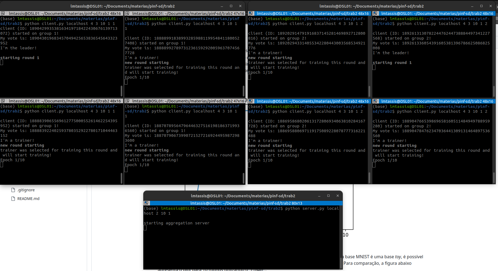
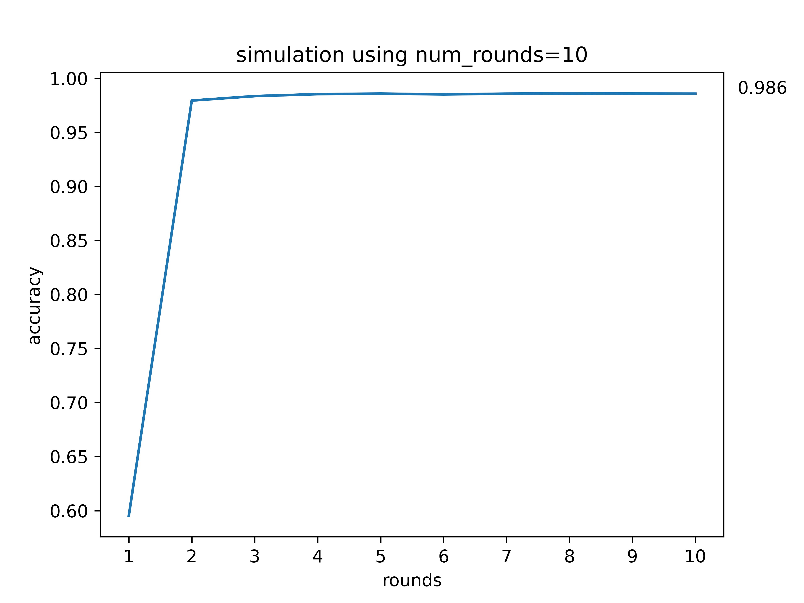
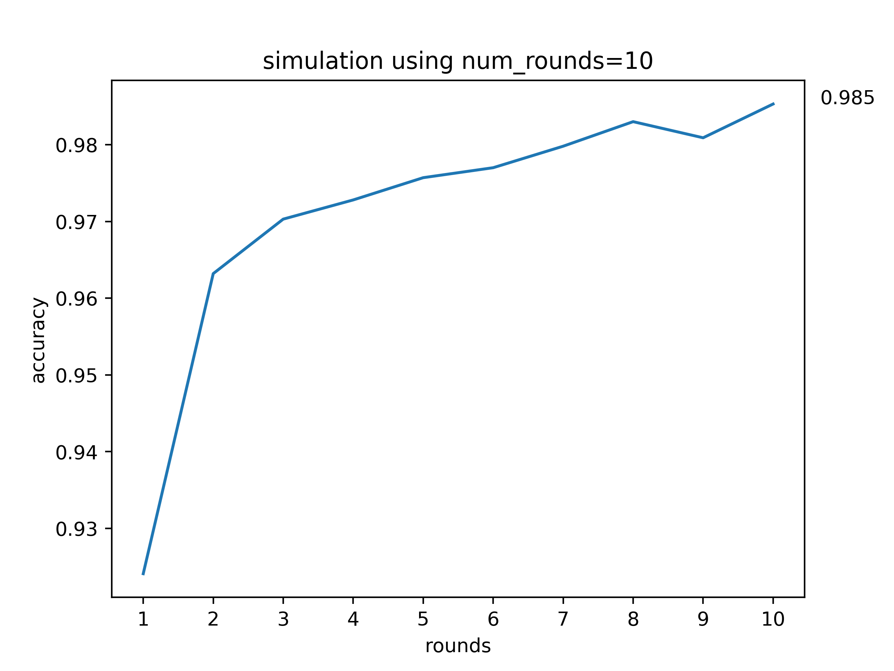
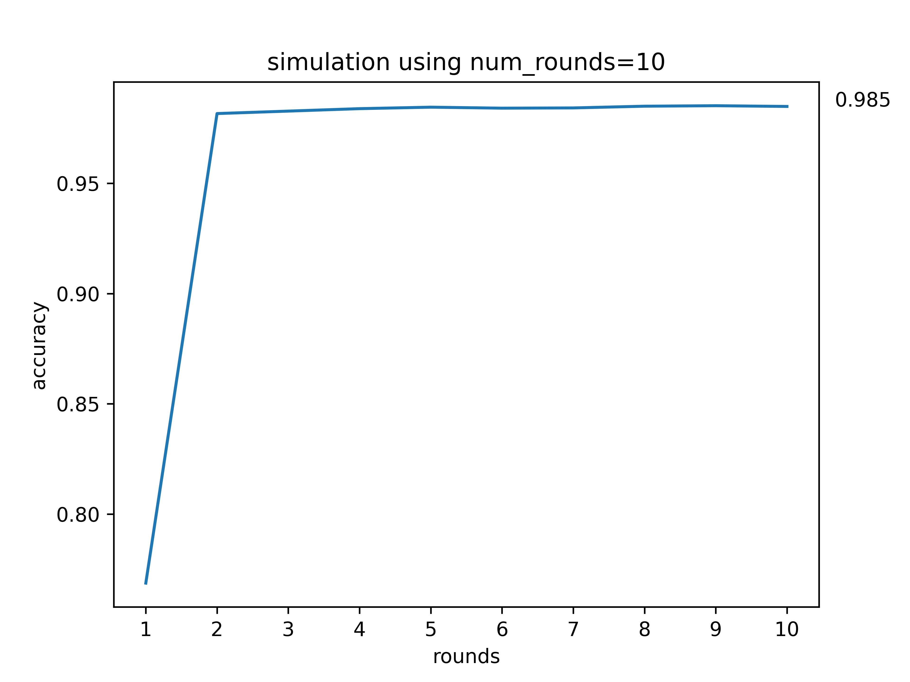

# Trabalho II - Aprendizado Federado Descentralizado

[Link para o vídeo de apresentação (passou um pouco do tempo de 3min por conta da simulação : ) )](https://drive.google.com/file/d/1wGZaxxJqIYRmmYM7IzpUW12jt34D8_9V/view?usp=sharing)

## Integrantes do grupo
2022132020 - Mestrado - Breno Aguiar Krohling

2021231578 - Mestrado - Lucas Miguel Tassis

2022241702 - Doutorado - Vitor Fontana Zanotelli

## Introdução

Nesse trabalho foi pedido a implementação do esquema de aprendizado federado descentralizado utilizando *publish/subscribe* com fila de mensagens como modo de comunicação entre os componentes do sistema. Além da eleição do líder, também foi pedida a implementação do aprendizado federado hierárquico, *i.e.*, com um servidor de agregação central. O *broker* de mensagens utilizado foi o EMQX com utilização da biblioteca `paho` no Python. Todos os códigos foram escritos na linguagem Python.

## Organização do diretório e instruções para execução

### Organização do diretório
O diretório está organizado da seguinte forma:

`./client.py`: é o arquivo que inicia os clientes que podem ser treinadores ou coordenadores (líderes).

`./server.py`: é o arquivo que inicia o servidor de agregação central.

`./trainer.py`: é o arquivo que contém a implementação da classe `Trainer`, que contém as implementações das operações feitas no `client.py`. Além de ter variáveis relacionados a eleição do coordenador, essa classe possui funções tanto para caso o cliente seja escolhido como treinador quanto líder.

`./aggregation_server.py`: é o arquivo que contém a implementação da classe `AggregationServer`, que contém as implementações das operações feitas no servidor de agregação central, utilizadas no  `server.py`.

### Instruções para execução
Para execução dos clientes basta utilizar o seguinte comando:

`python client.py <broker_address> <min_clients> <clients_per_round> <num_rounds> <accuracy_threshold> <group_number>`

Por exemplo, se quisermos inicializar um grupo (cluster) descentralizado em um *broker* no *localhost* com 4 clientes, sendo 3 escolhidos por round para treinamento, com número de rounds igual a 5, e meta de acurácia 0.95, basta:

`python client.py localhost 4 3 5 0.95 1`

Note que o `<group_number>` é só um valor para nomear o grupo. Como no trabalho foram pedidos dois grupos, utilizaremos 1 e 2, mas a implementação suporta mais grupos.

Para iniciar o servidor de agregação central, basta utilizar o seguinte comando:

`python server.py <broker_address> <num_groups> <num_rounds> <accuracy_threshold>`

Por exemplo, no exemplo dado para o servidor, seria:

`python client.py localhost 2 5 0.95`

Note que o servidor central também sabe o número de rounds e meta de acurácia (para que o processo possa ser finalizado). Ele também sabe o número de grupos descentralizados que serão utilizados na simulação.

## Implementação

A implementação desse trabalho foi baseada na implementação do trabalho 1 e do laboratório 6. Logo, os mecanismos que serão explicados nessa seção possuem várias semelhanças com os relatórios anteriores. Assim como no trabalho 1, todas as mensagens foram serializadas utilizando JSON.

### Inicialização

A primeira parte do sistema consiste na eleição do líder de cada grupo. Ao inicializar os clientes, a primeira ação é fazer o *subscribe* nas filas do sistema. Eles fazem *subscribe* em todas as filas, independente se serão líderes/treinadores. Essa decisão foi tomada para evitar alguns *deadlocks* por conta de sincronização do sistema após a eleição. Uma vez feito o *subscribe*, os clientes se apresentam aos outros clientes, enviando uma mensagem de inicialização para a fila **sd/trab42/group=GROUP_NUM/init**, onde o `GROUP_NUM` é o número do grupo descentralizado que aquele cliente faz parte. A mensagem simplesmente possui o ID do cliente, com formato: `{'id' : int}`.

### Eleição

Uma vez que todos os integrantes se cadastram nas filas dos outros clientes, o sistema passa para a eleição do líder. Cada cliente gera um valor e envia para a fila **sd/trab42/group=GROUP_NUM/election/**. A mensagem possui o ID do cliente e seu voto, como formato `{'id' : int, 'vote' : int}`. Esse valor gerado foi utilizando a biblioteca `uuid`, pois ela gera valores únicos, evitando colisão entre os votos. Uma vez que todos os clientes registram os votos de todos os outros clientes, cada cliente verifica o maior valor da lista: caso o maior valor seja o com seu ID, ele é o lider, caso contrário, ele não é o líder (é um treinador). Dessa forma, cada cliente determina se é o líder ou treinador e começa a funcionar como tal (existe uma *flag* `is_leader` em cada cliente que é utilizada para que cada cliente siga o fluxo de sua função).

### Treinamento

Uma vez que o líder é eleito, ele assume a função de coordenador do treinamento. Dessa forma, o sistema fica praticamente igual ao implementado no trabalho 1, com a exceção de que a parte de agregação e computação da média de acurácia dos rounds é feita no servidor central de agregação.

O líder no começo de cada round faz uma escolha aleatória do número mínimo de clientes e envia uma mensagem `{'selected' : list}` para a fila **sd/trab42/group=GROUP_NUM/selection**, com a lista dos IDs dos clientes selecionados para treinamento naquele round. Os treinadores recebem essa mensagem fazem um *parsing* da mensagem por seu `id`. Os clientes escolhidos iniciam o treinamento em sua base local, e os que não são escolhidos ficam esperando. No fim do treinamento, os treinadores escolhidos publicam a mensagem `{'id' : int, 'weights' : list, 'num_samples' : int}` na fila **sd/trab42/group=GROUP_NUM/round**. Note que para serializar os pesos, que inicialmente são organizados em uma lista de `np.array` , é necessário fazer uma transformação para uma lista de listas, que depois é desfeita no servidor para cálculo do *Federated Avg*. Uma vez que o líder recebe todos os pesos ele envia para o servidor de agregação central. Esse envio é feito com a mensagem `{'weights' : list, 'num_samples' : list, 'group' : int}`. Essa mensagem contém a lista de pesos com o peso de cada treinador, a lista de número de samples de cada treinador e o código do grupo. A mensagem é enviada para a lista **sd/trab42/aggregation_server/aggregation**. Note que a comunicação feita entre os grupos e o servidor central também utiliza uma fila de mensagens, que sempre contém o **"/aggregation_server/"** em seu nome. Uma vez que o servidor central recebe os pesos dos dois grupos, ele faz a agregação e envia de volta na fila **sd/trab42/aggregation_server/aggregated** para os líderes de cada grupo. A mensagem possui apenas os pesos agregados, com formato `{'weights' : list}`. 

Uma vez que os os líderes recebem os pesos agregados, eles passam para todos os treinadores (inclusive os que não treinaram). Esse envio é feito pela mensagem `{'weights' : list}` na fila **sd/trab42/group=GROUP_NUM/aggregation** (note que é diferente da fila que envia para o server central). . Os clientes recebem e fazem a atualização dos seus pesos locais. Ao atualizar, cada um dos clientes faz a validação dos novos pesos em sua base de teste local, e envia a mensagem `{'id' : int, 'accuracy' : float}` na fila **sd/trab42/group=GROUP_NUM/evaluation**. Ao receber a acurácia de todos os treinadores, o líder de cada grupo envia a mensagem com a lista de acurácias para o servidor central, para que seja computada a média de acurácia considerando os dois grupos. Essa mensagem é enviada para a fila **sd/trab42/aggregation_server/evaluation**, contendo `{accuracy_list : list}`.  O servidor central por sua vez, ao receber a mensagem de todos os grupos, computa a média e envia para os líderes com a mensagem `{'mean_accuracy' : float}`, para a fila **sd/trab42/aggregation_server/mean_accuracy**.

Os líderes verificam se já chegou no limite escolhido no início do treinamento, caso tenha passado o threshold, ele envia uma mensagem `{'stop' : bool}` para a fila **sd/trab42/group=GROUP_NUM/finish** indicando para os clientes terminarem o processo. Caso contrário, um novo round é inicializado, e o processo é repetido. Caso o modelo nunca alcance o limite de acurácia, ele irá parar com a mesma mensagem ao chegar no número máximo de rounds. Note que o servidor central também faz a verificação do limite de acurácia/número de rounds em seu próprio processo (por isso são passados como parâmetro ao inicializar o servidor central).

No final do treinamento também é gerado um plot com a acurácia ao longo dos rounds!

Obs.: Assim como no primeiro trabalho, ao incializar os clientes também é feito o *sampling* de sua base local para treinamento dos modelos. É feito um *sampling* aleatório de `10000 < num_samples < 20000` na base MNIST para servir como sua base de treino. Já para a base de teste, é feito um *sampling* de 3000 exemplos (~1/3 da base de teste) em todos os clientes.  Note que esse processo acaba permitindo que mais de um cliente tenha exemplos repetidos, mas como o tratamento disso não era interessante para/no escopo desse trabalho em específico, foi utilizado dessa forma.

## Exemplo de experimento e resultado

Para experimentar, utilizamos alguns setups diferentes como no primeiro trabalho e no laboratório 2 (utilizando a biblioteca `flower`) . Para exemplificar iremos mostrar experimentos com número de rounds igual 10 (e sem threshold de acurácia, para que sejam feito todos os rounds). Foram utilizados 4 clientes em cada grupo (e todos os 3 treinando em todos os rounds) e cada modelo treinou 10 épocas. As figuras abaixo apresentam os resultados obtidos. Para reproduzir esse experimento basta utilizar o comando: `python client.py localhost 4 3 10 1 1` para os treinadores do grupo 1; `python client.py localhost 4 3 10 1 2` para os treinadores do grupo 2; e `python server.py localhost 2 10 1` para inicializar o servidor central.

Primeiro podemos apresentar um exemplo do sistema funcionando e o plot dos terminais após a eleição (com os prints de coordenação/eleição):

Por fim, podemos apresentar o resultado obtido no experimento:

Pode-se observar que o modelo chegou em uma acurácia ~0.98 no segundo round. Como a base MNIST é uma base *toy*, é possível obter resultados com um menor número de rounds nela, como analisado no laboratório 2 e no primeiro trabalho. Para comparação, a figura abaixo apresenta o plot para 10 rounds utilizando o `flower`:

E a figura abaixo apresenta o plot para 10 rounds no trabalho 1:

Notamos que o modelo `flower` obteve um resultado melhor no primeiro round, e um resultado bem semelhante do trabalho 1. Assim como no primeiro trabalho, esse primeiro resultado pior pode ter sido por conta de alguma diferença de *sampling* dos dados de treinamento/ruído no treinamento da rede (em outros testes o primeiro round deu um resultado melhor, e em alguns outros semelhante ao apresentado). E também, a convergência foi mais rápida que a da biblioteca `flower`, mas que novamente pode ser só parte da aleatoriedade no treinamento da rede ao longo dos rounds ou *sampling* dos dados de treinamento/teste.

De qualquer forma, o fato mais importante é que houve aprendizado e convergência em nossa implementação e com esses resultados acreditamos que a performance foi satisfatória no problema.

## Conclusão

Nesse trabalho foi pedido a implementação do treinamento federado descentralizado hierárquico utilizando o modelo *publish/subscribe* com fila de mensagens, utilizando o broker EMQX. A implementação foi apresentada nesse documento e os experimentos apresentaram um resultado satisfatório e comparado ao da biblioteca `flower` e com a implementação do trabalho 1.
